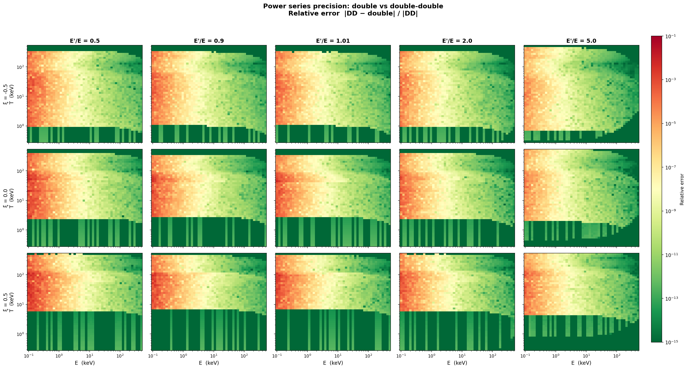

# Precision Check Report: double vs double-double power series

Relative error between the `double` and `DD` (double-double) implementations
of the Compton kernel power series, defined as:

    rel_err = |sigma_DD - sigma_double| / (|sigma_DD| + 1e-300)

## T-E precision map

Each panel shows the relative error on a 50x50 log-spaced grid in (E, T)
space. Columns vary the energy ratio E'/E (0.5, 0.9, 1.01, 2.0, 5.0); rows
vary the scattering angle xi (-0.5, 0.0, 0.5). All panels share the same
color scale.

The pattern is consistent across all (E'/E, xi) combinations: precision loss
is dominated by photon energy E. At low E (left side) and high T (upper
region), the power series requires more terms and involves larger
cancellations that exhaust double-precision significand bits. The energy ratio
and scattering angle have only a secondary effect.

## Sweep parameters

| Parameter | Values |
|-----------|--------|
| E (keV)   | 0.1, 0.5, 1, 5, 10, 50, 100, 500 |
| E'/E ratio | 0.5, 0.8, 0.9, 0.95, 0.99, 1.0, 1.01, 1.05, 1.1, 1.2, 1.5, 2.0, 3.0, 5.0 |
| xi        | -0.9, -0.5, -0.2, 0.0, 0.2, 0.5, 0.9 |
| T (keV)   | 0.5, 1, 5, 10, 20, 50, 100, 200, 500 |

- **Total evaluations:** 6350 (706 skipped due to ehat CF non-convergence)

## Overall statistics

| Statistic       | Value     |
|-----------------|-----------|
| Minimum         | 0.000e+00 |
| Median          | 1.86e-11  |
| Mean            | 8.01e-05  |
| 90th percentile | 1.03e-05  |
| 95th percentile | 1.64e-04  |
| 99th percentile | 1.76e-03  |
| Maximum         | 2.75e-02  |

### Fraction of evaluations exceeding error thresholds

| Threshold | Fraction |
|-----------|----------|
| > 1e-10   | 43.9%    |
| > 1e-8    | 29.1%    |
| > 1e-6    | 16.3%    |
| > 1e-4    | 6.0%     |

## Breakdown by incident energy E

The dominant factor controlling double-precision accuracy is the photon energy.
At low energies the kinematic parameters involve large cancellations that
double-precision arithmetic cannot resolve.

| E (keV) | Count | Median rel_err | 95th pctile | Max rel_err | Fraction > 1e-8 |
|--------:|------:|---------------:|------------:|------------:|----------------:|
|     0.1 |   803 |       7.65e-05 |    2.54e-03 |    2.75e-02 |           73.4% |
|     0.5 |   802 |       4.60e-07 |    2.16e-05 |    6.29e-04 |           72.8% |
|     1.0 |   802 |       7.05e-08 |    2.85e-06 |    7.80e-05 |           67.3% |
|     5.0 |   802 |       8.01e-10 |    3.12e-08 |    6.99e-07 |           15.0% |
|    10.0 |   802 |       1.18e-10 |    4.89e-09 |    3.15e-07 |            1.9% |
|    50.0 |   801 |       3.04e-12 |    1.21e-10 |    3.89e-09 |            0.0% |
|   100.0 |   799 |       7.37e-13 |    2.83e-11 |    4.71e-10 |            0.0% |
|   500.0 |   739 |       2.80e-14 |    6.04e-13 |    7.92e-12 |            0.0% |

**Key finding:** For E >= 10 keV, double precision agrees with DD to better
than ~1e-8 in virtually all cases. Below 1 keV, double precision introduces
errors of O(1e-5) to O(1e-2) and should not be trusted for high-accuracy work.

## Breakdown by temperature T

| T (keV) | Count | Median rel_err | 95th pctile | Max rel_err | Fraction > 1e-8 |
|--------:|------:|---------------:|------------:|------------:|----------------:|
|     0.5 |   784 |       1.89e-16 |    6.87e-08 |    2.68e-03 |            6.4% |
|     1.0 |   784 |       3.09e-16 |    3.94e-07 |    5.78e-04 |            7.5% |
|     5.0 |   784 |       2.49e-11 |    2.27e-04 |    3.57e-03 |           27.8% |
|    10.0 |   784 |       2.69e-10 |    3.33e-04 |    4.15e-03 |           33.6% |
|    20.0 |   784 |       3.09e-10 |    4.60e-04 |    6.04e-03 |           35.8% |
|    50.0 |   784 |       1.84e-09 |    8.02e-04 |    1.71e-02 |           40.8% |
|   100.0 |   782 |       3.81e-10 |    1.08e-04 |    1.66e-02 |           38.2% |
|   200.0 |   727 |       6.74e-10 |    1.18e-04 |    2.75e-02 |           41.5% |
|   500.0 |   137 |       9.40e-10 |    2.12e-04 |    2.19e-03 |           40.9% |

Higher temperatures produce more terms in the power series and increase
accumulated round-off in double precision.
At very low temperatures (T < 1 keV) the asymptotic series is preferred
by the Auto selector, so these rows mainly reflect low-energy cases
forced through the power series path.

## Breakdown by E'/E ratio

| E'/E  | Count | Median rel_err | 95th pctile | Max rel_err | Fraction > 1e-8 |
|------:|------:|---------------:|------------:|------------:|----------------:|
|  0.50 |   454 |       7.00e-11 |    9.66e-04 |    2.75e-02 |           34.4% |
|  0.80 |   453 |       3.95e-11 |    2.51e-04 |    1.71e-02 |           30.0% |
|  0.90 |   452 |       2.40e-11 |    3.07e-04 |    1.68e-02 |           29.4% |
|  0.95 |   452 |       1.53e-11 |    2.85e-04 |    7.98e-03 |           28.8% |
|  0.99 |   452 |       2.14e-11 |    1.78e-04 |    1.51e-02 |           28.3% |
|  1.00 |   452 |       1.65e-11 |    1.86e-04 |    1.25e-02 |           28.5% |
|  1.01 |   452 |       1.41e-11 |    2.06e-04 |    1.06e-02 |           29.4% |
|  1.05 |   452 |       1.66e-11 |    1.54e-04 |    6.19e-03 |           29.9% |
|  1.10 |   452 |       1.63e-11 |    1.82e-04 |    2.98e-03 |           28.3% |
|  1.20 |   452 |       1.40e-11 |    9.63e-05 |    4.73e-03 |           29.4% |
|  1.50 |   451 |       1.58e-11 |    1.33e-04 |    7.74e-03 |           27.7% |
|  2.00 |   452 |       1.45e-11 |    1.29e-04 |    4.65e-03 |           29.2% |
|  3.00 |   456 |       1.57e-11 |    3.95e-05 |    9.65e-03 |           27.0% |
|  5.00 |   468 |       1.69e-11 |    2.05e-05 |    5.38e-03 |           27.1% |

The energy ratio has minimal impact on precision loss -- the error distribution
is roughly flat across all ratios.

## Breakdown by scattering angle xi

| xi   | Count | Median rel_err | 95th pctile | Max rel_err | Fraction > 1e-8 |
|-----:|------:|---------------:|------------:|------------:|----------------:|
| -0.9 |   880 |       6.12e-10 |    1.51e-04 |    2.68e-03 |           38.1% |
| -0.5 |   882 |       3.50e-11 |    1.13e-04 |    1.80e-03 |           29.5% |
| -0.2 |   883 |       1.76e-11 |    1.27e-04 |    4.59e-03 |           29.1% |
|  0.0 |   889 |       2.25e-11 |    1.30e-04 |    6.04e-03 |           29.6% |
|  0.2 |   898 |       2.44e-11 |    2.48e-04 |    4.50e-03 |           29.6% |
|  0.5 |   910 |       4.25e-12 |    2.27e-04 |    5.55e-03 |           25.9% |
|  0.9 |  1008 |       1.14e-13 |    3.01e-04 |    2.75e-02 |           22.9% |

Forward scattering (xi near +1) has the lowest median error but occasional
large outliers; backward scattering (xi near -1) has consistently higher
median errors.

## Top 10 worst cases

All worst cases occur at E = 0.1 keV, confirming that low photon energy is
the primary driver of double-precision degradation.

| E (keV) | E' (keV) | E'/E | xi  | T (keV) | rel_err   |
|--------:|---------:|-----:|----:|--------:|----------:|
|     0.1 |     0.05 | 0.50 | 0.9 |   200.0 | 2.75e-02  |
|     0.1 |     0.08 | 0.80 | 0.9 |    50.0 | 1.71e-02  |
|     0.1 |     0.09 | 0.90 | 0.9 |   200.0 | 1.68e-02  |
|     0.1 |     0.05 | 0.50 | 0.9 |   100.0 | 1.66e-02  |
|     0.1 |     0.10 | 0.99 | 0.9 |   200.0 | 1.51e-02  |
|     0.1 |     0.09 | 0.90 | 0.9 |   100.0 | 1.36e-02  |
|     0.1 |     0.10 | 1.00 | 0.9 |   200.0 | 1.25e-02  |
|     0.1 |     0.10 | 1.01 | 0.9 |   200.0 | 1.06e-02  |
|     0.1 |     0.30 | 3.00 | 0.9 |    50.0 | 9.65e-03  |
|     0.1 |     0.10 | 1.01 | 0.9 |   100.0 | 9.28e-03  |

## Recommendations

1. **E >= 10 keV:** `PowerSeries` (double) is safe for all temperatures,
   angles, and energy ratios tested. Relative errors stay below ~1e-8.

2. **1 keV <= E < 10 keV:** Double precision introduces errors of O(1e-8) to
   O(1e-6). Acceptable for exploratory work but use `PowerSeriesHighPrecision`
   (DD) for production accuracy.

3. **E < 1 keV:** Double precision errors reach O(1e-2). Always use
   `PowerSeriesHighPrecision` (DD) or `Auto` (which defaults to DD).
